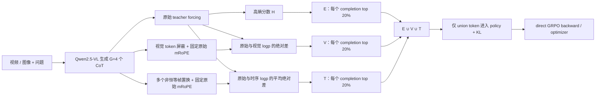

# Video-KTR：E/V/T token 归因与 Direct-GRPO 验证记录

更新日期：2026-09-21
交付分支：`<owner>/video-ktr-repro-handoff`

## 1. 当前结论

本轮工作已经从“只展示三类 token”扩展为两层可复现验证：

1. 对实际生成的 CoT 按高熵（E）、视觉敏感（V）、时序敏感（T）筛选 token，并保存可读上下文。
2. 在不使用 vLLM 的 direct GRPO 路径中，仅让 `E ∪ V ∪ T` 进入 policy 与 KL token loss；同时运行不加该掩码的 baseline，以便比较训练时长、显存与 GPU 利用率。

4 张 H200 的真实 direct-GRPO smoke 已通过；**不需要切换到 8 张 B200**。完整视频数据的 full run 已准备好，但按约定只由操作者在 GPU 机器手动启动。

| 阶段 | 状态 | 证据 / 下一步 |
| --- | --- | --- |
| 本地模型、完整数据、GRPO overlay | 已完成 | 模型与 Video-R1 数据位于 `<共享持久卷>` |
| E/V/T 非 GRPO 归因展示 | 已完成 | selector 与本地运行证据可按交接协议复查；artifact 不随 Git 提交 |
| 4×H200 baseline smoke | 历史通过 | 真实 generate → forward → backward → optimizer，`global_step=1`；长度奖励修复前，不能作最终 paired 对比 |
| 4×H200 KTR smoke | 历史通过 | 三类 CoT token、union mask、真实优化步已验证；修复后须与 baseline 同 commit 重跑 |
| full 同形状 KTR 容量 smoke | 历史通过（容量） | completion=512、时序置换=5 的真实优化步通过，峰值 92,197 MiB/卡；不作修复后 paired 对比 |
| 完整 video full run | 动态状态（探索性） | 已在修复前 dirty source 启动；不为提交而中断，不能与修复后 baseline 作结论性对比 |
| baseline 与 KTR 的完整对比 | 待手动启动 | 两个 full run 都完成后生成 `comparison.md/json` |

这里的 smoke 只证明链路、资源配置和一小步更新可执行；它不等同于完整训练收敛、任务正确率或跨数据集泛化结论。

## 2. 方法与实际运行 profile

当前可运行 profile 使用每个 prompt `G=4` 个 completion（不是概念图中的旧 `G=8`），并将同一条生成结果用于原始与 counterfactual teacher-forcing：



对 completion 有效位置 `i`：

```text
E_i = -Σ_v p(v | x, y_<i) log p(v | x, y_<i)
V_i = |logp_original(y_i) - logp_visual_masked(y_i)|
T_i = mean_k |logp_original(y_i) - logp_temporal_permuted,k(y_i)|
U   = top20%(E) ∪ top20%(V) ∪ top20%(T)
```

默认协议是 `selection_mode=paper` 与 `selection_scope=per_completion`：每一条 completion 单独精确取 `ceil(20% × valid_token_count)` 个位置。视觉与时序的前向共享原始未遮蔽输入的 mRoPE `position_ids`，避免把位置编码变化误当作视觉/时序敏感性。

| 项目 | baseline/KTR 对比 smoke | full 同形状 KTR smoke | full 默认 profile |
| --- | --- | --- | --- |
| GPU / rank | 4×H200 / 4 ranks | 4×H200 / 4 ranks | 4×H200 / 4 ranks |
| per-device batch / G | 1 / 4 | 1 / 4 | 1 / 4 |
| prompt / completion 上限 | 4096 / 256 | 4096 / 512 | 4096 / 512 |
| 视频帧数 / 最大像素 | 8 / 100352 | 8 / 100352 | 8 / 100352 |
| 时序置换数 | 2 | 5（含 reverse） | 5（含 reverse） |
| attention 实现 | `sdpa` | `sdpa` | `sdpa` |
| 训练长度 | 每 variant 1 optimizer step | KTR 1 optimizer step | 1 个 full video epoch（`MAX_STEPS=-1`） |

当前 host 上 FlashAttention2 与该 Transformers/Qwen mRoPE 组合会出现 `float32`/`bfloat16` rotary dtype 断言；`sdpa` 已由真实 smoke 验证。因此这是兼容性选择，并非 H200 容量不足。

## 3. 已验证环境、数据与容量

| 项目 | 已验证状态 |
| --- | --- |
| GPU 节点 | 集群 2，4× NVIDIA H200，每卡物理显存约 143,771 MiB |
| 模型 | `<MODEL_ROOT>/Video-R1/Qwen2.5-VL-7B-COT-SFT`，本地 BF16 checkpoint |
| 完整标注 | `<DATA_ROOT>/Video-R1-260k.json`，263,071 条记录 |
| full 输入 | launcher 在启动时重新解析并仅保留路径存在且非空的 video 记录；可筛出 116,248 条，**未做全量解码预检** |
| Python overlay | `.python-packages-grpo/`：Transformers `4.49.0.dev0`、tokenizers `0.21.4`、TRL `0.16.0`、DeepSpeed `0.15.4`；wheelhouse 不是 clean-Python 完整依赖闭包 |
| 基础运行时 | Python 3.12、PyTorch `2.10.0+cu128`、CUDA 12.8，以及 `numpy`/Pillow/huggingface-hub/filelock/packaging/PyYAML/requests/safetensors/tqdm/psutil/msgpack；`setup_grpo_env.sh` 会显式 gate |
| 分布式配置 | `src/r1-v/local_scripts/zero3.json`，ZeRO-3、BF16、gradient checkpointing |

容量结论应基于实测而非估算：在与 full 相同的 completion=512、5 次时序置换 profile 下，KTR 的单卡峰值为 92,197 MiB，距 H200 物理容量约有 51.6 GiB；full 脚本仍要求每张卡在启动前至少有 120 GiB 空闲，并在每次运行时重新检查。该证据足以支持 4×H200 启动 full，但仍不把单步 smoke 外推为完整 epoch 的无条件稳定性保证。

8×B200 没有被切换：该节点目前不是即插即用环境，缺少本轮所需的模型、数据、overlay 与已验证的 direct trainer。`run_full.sh` 也会明确拒绝静默把已验证的 H200 profile 换成 B200。

## 4. 真实 smoke 结果

本节数值来自本地 smoke artifact；`artifacts/` 被 `.gitignore` 排除且不会随本分支提交。远程协作者应按 [REMOTE_COLLAB_HANDOFF.md](REMOTE_COLLAB_HANDOFF.md) 的交接格式索取或复跑证据，而不是依赖仓库中的链接。

| 指标 | baseline | KTR | KTR − baseline |
| --- | ---: | ---: | ---: |
| 外层训练时长（秒） | 66.633 | 70.598 | +3.965 |
| Trainer 内部 runtime（秒） | 29.0875 | 31.7611 | +2.6736 |
| 单卡显存峰值（MiB，四卡最大） | 89,839 | 92,197 | +2,358 |
| GPU 利用率峰值 | 100% | 100% | 0 pp |
| 优化步 | 1 | 1 | — |

以上 paired 数值是**长度奖励修复前的历史链路/容量证据**：旧 KTR 将 union token 数误作 length-control 的 completion 长度，可能使 KTR 与 baseline 获得不同奖励。源码现已改为真实 `valid_mask` completion 长度；任何训练效果或奖励比较前，都必须在同一修复后 commit 上重跑 baseline/KTR。历史数值仍可用于说明完成一优化步时的资源量级。

新的 smoke 证据契约为：每个 run 都应保留 baseline/KTR 的 `training_summary.md`、`comparison.md`、`training_complete.json`、`source_provenance.txt` 和 `token_examples.md`；历史 smoke 在该 provenance 契约加入前结束，不能倒推为已记录源码快照。其关键数值已内联在本文件与交接手册中。

KTR 这一步的日志记录了 `E=202`、`V=202`、`T=202`、`U=360` 的 rank-local 聚合计数；分布式 trainer 的每 completion 平均值为 E/V/T=`45.5/45.5/45.5`、union=`80.188`，实际更新 token 比例为 `0.3570`。这些数字说明三类 mask 和 union mask 都非空，且确实进入了一次反向传播；它们不是对 token 语义质量的统计检验。

保存的 union token 记录有 192 条，E/V/T 标记数分别为 82/150/121，全部位于 `<think>` CoT 内。样例中可以看到高熵 token 如 `for`、`,`、`I`，视觉敏感 token 如 `question`、`letters`、`image`，时序敏感 token 如 `about`、`at`。这些词本身不必“看起来视觉或时序化”——判断依据是对应 counterfactual 下 token log-probability 的变化；完整上下文在上面的 token report 中。

该历史 smoke 结束时，launcher 已自动重启并检查到精确 `main.py` 进程，且当时没有遗留占卡任务；这不是当前 GPU 状态的声明。

### full 同形状容量 smoke

为避免仅由较短 completion 推断 full 容量，另外运行了 KTR-only 的同形状 smoke。它保持 4×H200、`G=4`、prompt=4096、8 帧与 full 一致，并使用 completion=512、5 个时序置换（含 reverse），执行了真实 `global_step=1`。

| 指标 | 同形状 KTR smoke |
| --- | ---: |
| 外层训练时长 | 79.013 s |
| Trainer 内部 runtime | 40.6615 s |
| 单卡显存峰值（四卡最大） | 92,197 MiB |
| GPU 利用率峰值 | 100% |
| E / V / T / union（每 completion 平均） | 48.25 / 48.25 / 48.25 / 84.0625 |
| union 更新比例 | 35.26% |

该历史容量 run 在结束时 PASS，且当时保活已恢复并验证。其资源摘要、训练完成记录和 CoT token 样例均为本地 artifact，路径契约见第 7 节；它没有新的启动时 provenance，也不承担修复后 paired 对比结论。

## 5. 手动启动 full run

`run_full.sh` 是唯一建议的 full launcher。它会持续向终端输出阶段进度与 GPU heartbeat，同时写入 `terminal.log`；数据筛选阶段每 5,000 条记录打印进度，训练阶段默认每 30 秒打印每卡显存与利用率。

脚本不再含私有机器路径默认值。先在本机 shell 显式配置（下面均为占位符）。当前 offline wheelhouse 依赖基础 GPU image 的显式 import gate；clean Python 在本版本不受支持：仅准备完整、版本锁定的辅助离线 bundle 仍不够，必须先扩展并验证 `setup_grpo_env.sh` 的 full-overlay 安装模式。不能让 GPU 节点联网补包；当前降级策略是继续使用已验证的 GPU image：

```bash
export MODEL_PATH=<MODEL_ROOT>/Video-R1/Qwen2.5-VL-7B-COT-SFT
export DATA_ROOT=<DATA_ROOT>
```

没有外部保活时，先运行 KTR（**不设置** `ALLOW_PAUSE_EXTERNAL_KEEPALIVE`）：

```bash
cd <REPO_ROOT>
FULL_ROOT=<ARTIFACT_ROOT>/manual-$(date -u +%Y%m%dT%H%M%SZ)
mkdir -p "${FULL_ROOT}"

VARIANT=ktr \
RUN_ROOT="${FULL_ROOT}/ktr" \
./run_full.sh
```

若节点有外部保活，再额外设置其两个身份并显式授权；两个变量缺任意一个时，launcher 会拒绝 `ALLOW_PAUSE_EXTERNAL_KEEPALIVE=1`：

```bash
export KEEPALIVE_MAIN=<KEEPALIVE_MAIN>
export KEEPALIVE_LAUNCHER=<KEEPALIVE_LAUNCHER>
ALLOW_PAUSE_EXTERNAL_KEEPALIVE=1 VARIANT=ktr RUN_ROOT="${FULL_ROOT}/ktr" ./run_full.sh
```

若需要完整可比的资源对照，在 KTR 成功结束后单独运行 baseline；不要让两个变体同时抢同一批 GPU：

```bash
cd <REPO_ROOT>
VARIANT=baseline \
RUN_ROOT="${FULL_ROOT}/baseline" \
./run_full.sh

/usr/bin/python3.12 src/grpo_compare_runs.py \
  --baseline-dir "${FULL_ROOT}/baseline" \
  --ktr-dir "${FULL_ROOT}/ktr" \
  --output-dir "${FULL_ROOT}/comparison" \
  --require-pass
```

默认参数为 1 epoch、`G=4`、prompt 4096、completion 512、8 帧、5 次时序置换、每 500 step 保存 checkpoint、只保留最近 2 个 checkpoint。用于受控短跑时可覆盖，例如：

```bash
VARIANT=ktr MAX_STEPS=10 \
RUN_ROOT=<ARTIFACT_ROOT>/debug-ktr-10 \
./run_full.sh
```

full 完成的最低验收条件是：脚本零退出、`training/training_complete.json` 存在、`training_summary.md/json` 标为 succeeded、`source_provenance.txt` 存在，并且 `gpu_metrics.jsonl` 持续有采样记录。若跑 KTR 与 baseline 两个变体，还应确认二者 `source_provenance.txt` 的关键源码 hash/配置一致，再检查 `comparison/comparison.md` 中的时长、四卡最大峰值显存、利用率与 KTR 最后一步 token 指标。

## 6. 外部保活的安全生命周期

某些 GPU 节点有不属于本项目的 all-GPU keep-alive。只有同时配置 `KEEPALIVE_MAIN` 与 `KEEPALIVE_LAUNCHER` 后，full launcher 才能识别和管理它；未配置时脚本会明确提示“不检测/不控制”，操作者须自行确认没有冲突。配置后规则如下：

1. 默认检测到它就拒绝启动，绝不悄悄重叠训练与保活。
2. 只有显式传入 `ALLOW_PAUSE_EXTERNAL_KEEPALIVE=1` 后，才会按精确 PID、`/proc` start ticks 和命令行校验，发送 `TERM`；不使用 `pkill` 或 `SIGKILL`。
3. 正常结束、失败、`INT`、`TERM` 都会先停止并等待 launcher 所追踪的 `torchrun`，然后才恢复原始保活 launcher；恢复最多等待 30 秒并验证 `main.py` 进程。
4. 若无法确认训练已停，脚本会故意保持保活暂停，避免两个任务争抢 GPU，并在终端打印 CRITICAL 信息。

配置了 keep-alive 管理时，无论成功或失败，脚本末尾都会打印下面的人工恢复命令。它是自动恢复验证失败、且确认训练已经停止和 `main.py` 不存在时的兜底；未配置 keep-alive 时，脚本只会明确说明没有可用的恢复命令：

```bash
bash <KEEPALIVE_LAUNCHER>
```

## 7. 预期产物与仍需观察的项目

每个 run root 会保留，不会覆盖旧证据：

```text
<run-root>/
├── terminal.log                 # 阶段与 heartbeat
├── training.log                 # torchrun 标准输出
├── launch_config.txt            # 实际启动参数
├── source_provenance.txt         # HEAD、dirty 状态/差异 hash、关键源码 hash、运行时版本
├── gpu_metrics.jsonl            # 每卡显存、util、温度、功耗的时序采样
├── resource_monitor.log
├── training_summary.md/json     # duration、每卡峰值/均值
├── Video-R1-260k-video-path-verified.json
├── Video-R1-260k-video-path-verified.manifest.json
└── training/
    ├── training_complete.json
    ├── checkpoint-*/            # 按 save_steps 产生
    └── selected_tokens_rank*.jsonl  # 仅 bounded debug 明确开启时写入
```

full 默认关闭逐 token JSONL，避免 116,248 条视频训练产生无界的证据文件；smoke 已经提供了三类 CoT token 的可读样例。若确实要检查 full 中的 token，需要先把 `MAX_STEPS` 设成有限值，再明确设 `FULL_OUTPUT_SELECTED_TOKEN=1`。path-verified 只表示路径存在且非空；若 full 因 codec/坏视频失败，保留失败 evidence 后新增有界 decode preflight，不得把原 manifest 描述为 decode-verified。

还未完成的是修复后 full epoch 的实际耗时、长程稳定性、checkpoint 恢复、paired baseline/KTR 对比和最终任务指标；这些必须以后续真实 run 的落盘数据为准。当前 active full 在修复前 dirty source 启动，缺少启动时自动 provenance，因此仅作探索性长跑/资源观察，不为本次提交而中断。若 full 因容量门禁、视频解码或训练错误退出，保留其 artifact、先核查 `terminal.log`/`training.log`/`training_summary.md`，而不是直接切到 B200 或改变算法配置。
