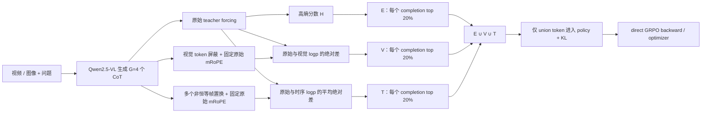

# Video-KTR：E/V/T token 归因与 Direct-GRPO 验证记录

更新日期：2026-09-22
交付分支：`<owner>/video-ktr-repro-handoff`

> 本文件保留的 H200 章节是故障定位历史，不能覆盖下列 B200 active profile。当前执行、交接与手动 full 命令以 [B200_REPRODUCTION.md](B200_REPRODUCTION.md) 和 [REMOTE_COLLAB_HANDOFF.md](REMOTE_COLLAB_HANDOFF.md) 为准。

## 0. 当前 B200 执行计划（active）

集群 3 已完成 8×B200 paired smoke；baseline/KTR 各有一次真实 optimizer step，FA2、Qwen rotary 兼容、E/V/T/union、资源遥测与保活恢复均为 PASS。full 尚未执行，且必须由操作者手动启动。

| 阶段 | 状态 | 可复查证据 / 下一步 |
| --- | --- | --- |
| B200 isolated venv / runtime bridge | 已验证 | pinned Transformers/TRL/DeepSpeed + B200 FA2 `sm_100` gate；CUDA headers、`ptxas` 和持久 Triton cache 已配置 |
| 模型身份 | full 前必须通过 | 可信 exact-revision manifest 覆盖全部顶层常规模型文件，并由 runtime hash gate 复核；旧“4 个 weight shard 已比对”没有当前机器可审计证据，不能当作本机重哈希结论 |
| B200 paired smoke | 已通过 | 8 条固定**视频**、8 ranks、prompt=16384、completion=768、G=8、FA2、8 帧；baseline 94.840 s，KTR 95.008 s；不是 mixed sampler 分布式覆盖 |
| selector 语义 | 已通过 | E/V 每 completion 精确 top-20%；视频 T 同样精确 top-20%，image T 设计为全零；absolute delta、每 rank/step 单个非恒等置换、分离 image/video token ID |
| Holmes path 数据 | 当前降级可用 | `15,365 / 16,916`（8765 image + 6600 video）；缺 1551 video，strict full 默认拒绝 |
| mixed media decode | full 前门禁已实现 | CPU-only、spawned worker、硬超时、实时 ETA；decoder rejection 默认拒绝 |
| B200 full KTR / baseline | 待操作者启动 | 使用 `run_full_b200.sh`；两个 variant 需串行运行并比较 artifact |

严格 full（数据补齐后）只需显式授权保活生命周期；当前数据则还必须显式承认 reduced：

```bash
# strict：仅当 16,916 条媒体均可用且 decode=0 rejection 时才会通过
B200_ALLOW_PAUSE_KEEPALIVE=1 VARIANT=ktr ./run_full_b200.sh

# 当前可运行，但输出会标为 reproduction_class=reduced-media-subset
B200_ALLOW_PAUSE_KEEPALIVE=1 B200_ALLOW_REDUCED_HOLMES=1 \
  VARIANT=ktr ./run_full_b200.sh
```

`--max_pixels 401408` 保持为上游请求值；随仓库的 Qwen 文件型视频预处理实际单帧上限约 105369，因此 B200 profile 同时记录 requested/effective/observed 值，不能把 CLI 值误报为实际逐帧分辨率。

## 1. 历史 4×H200 结论（归档，不是当前执行路径）

本轮工作已经从“只展示三类 token”扩展为两层可复现验证：

1. 对实际生成的 CoT 按高熵（E）、视觉敏感（V）、时序敏感（T）筛选 token，并保存可读上下文。
2. 在不使用 vLLM 的 direct GRPO 路径中，仅让 `E ∪ V ∪ T` 进入 policy 与 KL token loss；同时运行不加该掩码的 baseline，以便比较训练时长、显存与 GPU 利用率。

4 张 H200 的真实 direct-GRPO smoke 已通过，但它存在历史 selector/FA2/profile 偏差，且旧 full 有 collective 故障；它只保留作定位证据。当前已切换到上方 8×B200 active profile，full 仍按约定仅由操作者手动启动。

| 阶段 | 状态 | 证据 / 下一步 |
| --- | --- | --- |
| 本地模型、完整数据、GRPO overlay | 已完成 | 模型与 Video-R1 数据位于 `<共享持久卷>` |
| E/V/T 非 GRPO 归因展示 | 已完成 | selector 与本地运行证据可按交接协议复查；artifact 不随 Git 提交 |
| 4×H200 baseline smoke | 历史通过 | 真实 generate → forward → backward → optimizer，`global_step=1`；长度奖励修复前，不能作最终 paired 对比 |
| 4×H200 KTR smoke | 历史通过 | 三类 CoT token、union mask、真实优化步已验证；修复后须与 baseline 同 commit 重跑 |
| full 同形状 KTR 容量 smoke | 历史通过（容量） | completion=512、时序置换=5 的真实优化步通过，峰值 92,197 MiB/卡；不作修复后 paired 对比 |
| 旧完整 video full run | step-501 恢复已通过，待跨越 step-529 回归 | 旧 run 在约 step 529 出现 rank 间 collective timeout；checkpoint-500 的受控恢复已完成完整 ZeRO load 和 step 501，但仍不能作正式结果 |
| baseline 与 KTR 的完整对比 | 待手动启动 | 两个 full run 都完成后生成 `comparison.md/json` |

这里的 smoke 只证明链路、资源配置和一小步更新可执行；它不等同于完整训练收敛、任务正确率或跨数据集泛化结论。

## 2. 历史 H200 方法与运行 profile（归档）

当前可运行 profile 使用每个 prompt `G=4` 个 completion（不是概念图中的旧 `G=8`），并将同一条生成结果用于原始与 counterfactual teacher-forcing：



对 completion 有效位置 `i`：

```text
E_i = -Σ_v p(v | x, y_<i) log p(v | x, y_<i)
V_i = |logp_original(y_i) - logp_visual_masked(y_i)|
T_i = mean_k |logp_original(y_i) - logp_temporal_permuted,k(y_i)|
U   = top20%(E) ∪ top20%(V) ∪ top20%(T)
```

默认协议是 `selection_mode=paper` 与 `selection_scope=per_completion`：每一条 completion 单独精确取 `ceil(20% × valid_token_count)` 个位置。视觉与时序的前向共享原始未遮蔽输入的 mRoPE `position_ids`，避免把位置编码变化误当作视觉/时序敏感性。

| 项目 | baseline/KTR 对比 smoke | full 同形状 KTR smoke | full 默认 profile |
| --- | --- | --- | --- |
| GPU / rank | 4×H200 / 4 ranks | 4×H200 / 4 ranks | 4×H200 / 4 ranks |
| per-device batch / G | 1 / 4 | 1 / 4 | 1 / 4 |
| prompt / completion 上限 | 4096 / 256 | 4096 / 512 | 4096 / 512 |
| 视频帧数 / 最大像素 | 8 / 100352 | 8 / 100352 | 8 / 100352 |
| 时序置换数 | 2 | 5（含 reverse） | 5（含 reverse） |
| attention 实现 | `sdpa` | `sdpa` | `sdpa` |
| 训练长度 | 每 variant 1 optimizer step | KTR 1 optimizer step | 1 个 full video epoch（`MAX_STEPS=-1`） |

当前 host 上 FlashAttention2 与该 Transformers/Qwen mRoPE 组合会出现 `float32`/`bfloat16` rotary dtype 断言；`sdpa` 已由真实 smoke 验证。因此这是兼容性选择，并非 H200 容量不足。

## 3. 历史 H200 环境、数据与容量（归档）

| 项目 | 已验证状态 |
| --- | --- |
| GPU 节点 | 集群 2，4× NVIDIA H200，每卡物理显存约 143,771 MiB |
| 模型 | `<MODEL_ROOT>/Video-R1/Qwen2.5-VL-7B-COT-SFT`，本地 BF16 checkpoint |
| 完整标注 | `<DATA_ROOT>/Video-R1-260k.json`，263,071 条记录 |
| full 输入 | launcher 先筛选路径存在且非空的 video（历史可筛出 116,248 条），默认再用训练同一 Qwen/torchvision 预处理进行隔离 decode verification；最终数目以本 run manifest 为准 |
| Python overlay | `.python-packages-grpo/`：Transformers `4.49.0.dev0`、tokenizers `0.21.4`、TRL `0.16.0`、DeepSpeed `0.15.4`；wheelhouse 不是 clean-Python 完整依赖闭包 |
| 基础运行时 | Python 3.12、PyTorch `2.10.0+cu128`、CUDA 12.8，以及 `numpy`/Pillow/huggingface-hub/filelock/packaging/PyYAML/requests/safetensors/tqdm/psutil/msgpack；`setup_grpo_env.sh` 会显式 gate |
| 分布式配置 | `src/r1-v/local_scripts/zero3.json`，ZeRO-3、BF16、gradient checkpointing |

容量结论应基于实测而非估算：在与 full 相同的 completion=512、5 次时序置换 profile 下，KTR 的单卡峰值为 92,197 MiB，距 H200 物理容量约有 51.6 GiB；full 脚本仍要求每张卡在启动前至少有 120 GiB 空闲，并在每次运行时重新检查。该证据足以支持 4×H200 启动 full，但仍不把单步 smoke 外推为完整 epoch 的无条件稳定性保证。

这段 H200 容量结论不再决定当前方案：8×B200 已完成真实硬件 paired smoke，使用独立的 `setup_b200_env.sh`、`somke-b200.sh` 与 `run_full_b200.sh`。B200 的最终状态、full 数据门禁和手动命令见 [B200_REPRODUCTION.md](B200_REPRODUCTION.md)。

## 4. 真实 smoke 结果

本节数值来自本地 smoke artifact；`artifacts/` 被 `.gitignore` 排除且不会随本分支提交。远程协作者应按 [REMOTE_COLLAB_HANDOFF.md](REMOTE_COLLAB_HANDOFF.md) 的交接格式索取或复跑证据，而不是依赖仓库中的链接。

| 指标 | baseline | KTR | KTR − baseline |
| --- | ---: | ---: | ---: |
| 外层训练时长（秒） | 66.633 | 70.598 | +3.965 |
| Trainer 内部 runtime（秒） | 29.0875 | 31.7611 | +2.6736 |
| 单卡显存峰值（MiB，四卡最大） | 89,839 | 92,197 | +2,358 |
| GPU 利用率峰值 | 100% | 100% | 0 pp |
| 优化步 | 1 | 1 | — |

以上 paired 数值是**长度奖励修复前的历史链路/容量证据**：旧 KTR 将 union token 数误作 length-control 的 completion 长度，可能使 KTR 与 baseline 获得不同奖励。源码现已改为真实 `valid_mask` completion 长度；任何训练效果或奖励比较前，都必须在同一修复后 commit 上重跑 baseline/KTR。历史数值仍可用于说明完成一优化步时的资源量级。

新的 smoke 证据契约为：每个 run 都应保留 baseline/KTR 的 `training_summary.md`、`comparison.md`、`training_complete.json`、`source_provenance.txt` 和 `token_examples.md`；历史 smoke 在该 provenance 契约加入前结束，不能倒推为已记录源码快照。其关键数值已内联在本文件与交接手册中。

KTR 这一步的日志记录了 `E=202`、`V=202`、`T=202`、`U=360` 的 rank-local 聚合计数；分布式 trainer 的每 completion 平均值为 E/V/T=`45.5/45.5/45.5`、union=`80.188`，实际更新 token 比例为 `0.3570`。这些数字说明三类 mask 和 union mask 都非空，且确实进入了一次反向传播；它们不是对 token 语义质量的统计检验。

保存的 union token 记录有 192 条，E/V/T 标记数分别为 82/150/121，全部位于 `<think>` CoT 内。样例中可以看到高熵 token 如 `for`、`,`、`I`，视觉敏感 token 如 `question`、`letters`、`image`，时序敏感 token 如 `about`、`at`。这些词本身不必“看起来视觉或时序化”——判断依据是对应 counterfactual 下 token log-probability 的变化；完整上下文在上面的 token report 中。

该历史 smoke 结束时，launcher 已自动重启并检查到精确 `main.py` 进程，且当时没有遗留占卡任务；这不是当前 GPU 状态的声明。

### full 同形状容量 smoke

为避免仅由较短 completion 推断 full 容量，另外运行了 KTR-only 的同形状 smoke。它保持 4×H200、`G=4`、prompt=4096、8 帧与 full 一致，并使用 completion=512、5 个时序置换（含 reverse），执行了真实 `global_step=1`。

| 指标 | 同形状 KTR smoke |
| --- | ---: |
| 外层训练时长 | 79.013 s |
| Trainer 内部 runtime | 40.6615 s |
| 单卡显存峰值（四卡最大） | 92,197 MiB |
| GPU 利用率峰值 | 100% |
| E / V / T / union（每 completion 平均） | 48.25 / 48.25 / 48.25 / 84.0625 |
| union 更新比例 | 35.26% |

该历史容量 run 在结束时 PASS，且当时保活已恢复并验证。其资源摘要、训练完成记录和 CoT token 样例均为本地 artifact，路径契约见第 7 节；它没有新的启动时 provenance，也不承担修复后 paired 对比结论。

## 5. 已定位的 full 故障与修复状态

旧探索性 KTR full 已停止，不存在本项目占卡训练进程。它不是 OOM：最高单卡观测约 115.7 GiB，低于 H200 的约 143.8 GiB。失败时 rank 1/2/3 在下一次 ZeRO-3 `_ALLGATHER_BASE` 等待约 30 分钟，而 rank 0 的最后 enqueue/complete 均停在前一 collective；同时 GPU 0 长时间近 0% 利用率、其余卡接近满载。

这支持但**没有单独证明**下列最高置信假设：rank 0 在下一 collective 前的本地 Qwen 视频预处理停住。当前 reader 是 torchvision whole-file decode，旧 full manifest 只做路径/非空校验，因此异常或极慢视频可造成这种 rank 偏斜。

2026-09-22 的首次 checkpoint-500 诊断在任何 batch 之前失败，原因与旧 step-529 事故不同：PyTorch 2.10 的 `torch.load` 默认 `weights_only=True`，而 DeepSpeed 0.15.4 的旧 ZeRO optimizer shard 含 `ZeroStageEnum` 与 `LossScaler`。四个 rank 都在 checkpoint load 退出，无 rank trace、无 NCCL timeout、无视频 decode。修复后，恢复路径仅在 `trainer.train(resume_from_checkpoint=...)` 的作用域内 allowlist 这两个已静态核验的 DeepSpeed 类，保持 `weights_only=True`；不使用全局 `TORCH_FORCE_NO_WEIGHTS_ONLY_LOAD=1`。

| 修复 / 诊断 | 实现 | 已验证范围 |
| --- | --- | --- |
| 同一路径 decode preflight | `src/grpo_verify_video_decode.py` 在 CPU-only spawned worker 执行 Qwen `fetch_video`（decode、抽帧、resize）；超时后 TERM→KILL，不可杀死或意外 worker crash 则 fail-fast；即使 0 条通过也会留下 failed manifest/rejections | 真实 4-video smoke 为 4/4；16 worker、32-video 抽样为 32/32、0 timeout；0-valid 负向测试确认诊断产物仍会保留；不能外推全量耗时/零 rejection |
| 训练/预检 reader 一致 | full 强制 `FORCE_QWENVL_VIDEO_READER=torchvision`，并把 source SHA、video root、decoder/backend、nframes/max-pixels 写入 manifest；`NFRAMES` gate 为不小于 2 的偶数 | 静态/非训练 decode smoke 已通过；错误 root 的 reuse manifest 会被拒绝 |
| rank 轨迹 | `RANK_PHASE_TRACE=1` 时，`training/rank_trace_rank*.jsonl` 记录 decode、generate、policy、V/T、ref、metrics 边界 | checkpoint-500→501 恢复的四 rank 均记录 15 个事件并到达 `metrics_done`；仍须跨过旧 step-529 |
| generation / ZeRO 保护 | 多 rank 显式 `synced_gpus=True`，并将 `DS3_GATHER_FOR_GENERATION` 传至 TRL unwrap | unit test 覆盖 flag 实际传入；该项不修复 generation 前 decode stall |
| NCCL 事后证据 | 默认 diagnostics、10 分钟 DDP timeout、per-rank torchrun log、NCCL trace/dump 与失败 marker；watchdog 的内存 trace 写入 rank stderr/log，而非虚构磁盘 `fr_trace.py` 输入 | launcher 静态检查通过；需故障 run 才会产生 dump |
| resume 语义与 safe load | resume 强制新 run root、旧 path-verified JSON、关闭 decoder filtering，校验 4 rank checkpoint shards；训练时仅 scoped allowlist `ZeroStageEnum`/`LossScaler`；历史全 video 数据集走父类 `RandomSampler`，不应用 mixed-modality block sampler | 4 个 24 GiB optimizer shard 的 unsafe-global 静态扫描均仅为这两个类；预检经同一 DeepSpeed loader 通过，4×H200 从 checkpoint-500 完成 step 501、`phase 7/7: PASS`、结束后 GPU 归零 |
| launcher 安全预检 | `PREFLIGHT_ONLY=1` 完整执行容量/import/path/decode manifest，但明确不创建 `torchrun`；长预检为独立受跟踪 process group，已授权 keep-alive 会在空闲显存 gate **之前**按精确 PID 暂停 | 4 条真实视频预检通过，写 `preflight_complete.json`（`torchrun_started=false`）；在 decoder 阶段向唯一 launcher 发送 TERM 的测试确认 process group/worker 全部退出、无 GPU 残留 |

全量预检会消耗 CPU/存储时间（16 worker 的 32 条抽样约一分钟，且样本并不代表全量）。它会每 30 秒显示吞吐和 ETA；这是正式安全 full 的前置阶段，不能为了省时在正式结果中悄悄跳过。若有 rejected record，输出必须称为“数据质量过滤后的降级复现”，并保留 manifest/rejections SHA；0 条通过或 worker crash 不是可继续训练的过滤结果，而是带证据的失败。

历史 full 的 116,248 条输入均为 video。为 checkpoint-500 诊断复原其取样契约，直接 trainer 对单一 modality 委托父类 `RandomSampler`；使用历史 seed 的只读重建显示旧故障附近的下一 global batch（step 530）rank 0 对应 `problem_id=192684`。这让短恢复能覆盖具体疑点，但显式 generation 同步、额外 phase trace 和诊断环境仍使它只能作为回归定位，不能与正式 baseline/KTR 指标混合。

## 6. 历史 H200 手动启动：先诊断恢复，再正式 full（归档；不得在集群 3 执行）

`run_full.sh` 是唯一建议的 full launcher，且 `RUN_ROOT` 必须是**尚不存在**的新目录（原子创建，旧 artifact 不会被追加）。它会持续向终端输出：path 筛选进度、decoder verification 的 30 秒吞吐/ETA、rank 0 的训练进度和 30 秒 GPU heartbeat；四个 rank 的完整标准流保存到 `torchrun-logs/`。

脚本不再含私有机器路径默认值。先在本机 shell 显式配置（下面均为占位符）。当前 offline wheelhouse 依赖基础 GPU image 的显式 import gate；clean Python 在本版本不受支持：仅准备完整、版本锁定的辅助离线 bundle 仍不够，必须先扩展并验证 `setup_grpo_env.sh` 的 full-overlay 安装模式。不能让 GPU 节点联网补包；当前降级策略是继续使用已验证的 GPU image：

```bash
export MODEL_PATH=<MODEL_ROOT>/Video-R1/Qwen2.5-VL-7B-COT-SFT
export DATA_ROOT=<DATA_ROOT>
# 默认 NFRAMES=8；如覆写，必须是 >=2 的偶数。
```

第一步只做 checkpoint-500 的受控诊断恢复（**不设置** `ALLOW_PAUSE_EXTERNAL_KEEPALIVE`，除非已按第 7 节显式配置）。它必须沿用下面指定的旧 path-verified JSON，关闭 decoder filtering；历史输入全为 video，因此终端会确认使用父类 `RandomSampler`。phase 2 会先静态核验 4 个 optimizer shard 只含受限 allowlist，并通过同一 DeepSpeed loader 读一个小 model-state probe；无需设置不安全的 `TORCH_FORCE_NO_WEIGHTS_ONLY_LOAD`。`MAX_STEPS=540` 只比旧 checkpoint 多跑约 40 个 global step，用于跨越旧故障点，不得作为正式结果：

```bash
cd <REPO_ROOT>
old_run=<ARTIFACT_ROOT>/ktr-20260921T131854Z
diag_run=<ARTIFACT_ROOT>/ktr-checkpoint500-diag-$(date -u +%Y%m%dT%H%M%SZ)

VARIANT=ktr \
RUN_ROOT="${diag_run}" \
PREPARED_DATASET="${old_run}/Video-R1-260k-video-verified.json" \
USE_EXISTING_PREPARED_DATASET=1 \
RESUME_FROM_CHECKPOINT="${old_run}/training/checkpoint-500" \
VERIFY_VIDEO_DECODE=0 \
MAX_STEPS=540 \
SKIP_FINAL_MODEL_SAVE=true \
NCCL_DIAGNOSTICS=1 \
RANK_PHASE_TRACE=1 \
./run_full.sh
```

若该诊断跨过旧故障点且结束为 PASS，再从 step 0 启动正式 KTR full。正式 full 默认 `VERIFY_VIDEO_DECODE=1`、16 worker、120 秒单视频硬超时；它会留下 verified JSON、完整 rejection JSON 和 manifest SHA。若 manifest 中 `rejected_records>0`，该 run 只能称为数据质量过滤后的降级复现：

```bash
full_root=<ARTIFACT_ROOT>/ktr-decoder-verified-$(date -u +%Y%m%dT%H%M%SZ)

VARIANT=ktr \
RUN_ROOT="${full_root}" \
VERIFY_VIDEO_DECODE=1 \
VIDEO_DECODE_WORKERS=16 \
VIDEO_DECODE_TIMEOUT_SECONDS=120 \
NCCL_DIAGNOSTICS=1 \
RANK_PHASE_TRACE=0 \
./run_full.sh
```

若节点有外部保活，以上任一命令前再额外设置其两个身份并显式授权；两个变量缺任意一个时，launcher 会拒绝暂停授权：

```bash
export KEEPALIVE_MAIN=<KEEPALIVE_MAIN>
export KEEPALIVE_LAUNCHER=<KEEPALIVE_LAUNCHER>
export ALLOW_PAUSE_EXTERNAL_KEEPALIVE=1
```

若需要完整可比的资源对照，在 KTR 成功结束后，使用相同 decoder policy 单独运行 baseline；不要让两个变体同时抢同一批 GPU：

```bash
cd <REPO_ROOT>
VARIANT=baseline \
RUN_ROOT=<ARTIFACT_ROOT>/baseline-decoder-verified-<UTC> \
VERIFY_VIDEO_DECODE=1 \
VIDEO_DECODE_WORKERS=16 \
./run_full.sh

/usr/bin/python3.12 src/grpo_compare_runs.py \
  --baseline-dir <BASELINE_RUN_ROOT> \
  --ktr-dir <KTR_RUN_ROOT> \
  --output-dir <COMPARISON_ROOT> \
  --require-pass
```

默认参数为 1 epoch、`G=4`、prompt 4096、completion 512、8 帧、5 次时序置换、每 500 step 保存 checkpoint、只保留最近 2 个 checkpoint。用于受控短跑时可覆盖，例如：

```bash
VARIANT=ktr MAX_STEPS=10 \
RUN_ROOT=<ARTIFACT_ROOT>/debug-ktr-10 \
./run_full.sh
```

诊断最低验收条件是：终端出现 `[ktr] homogeneous dataset uses the parent RandomSampler`、`synced_gpus=True`、`phase 7/7: PASS`；`training/training_complete.json` 的 `global_step >= 540`，四份 `rank_trace_rank*.jsonl` 都跨过旧故障区域且不存在新的 timeout。若仍失败，应先看 `training.log`、`torchrun-logs/` 中 watchdog dump 与每 rank 的最后一条 phase trace；本 launcher 未写入可供 `fr_trace.py` 读取的独立文件，不能把它当作可执行的事后命令。正式 full 的最低验收条件是：脚本零退出、`training/training_complete.json` 存在、`training_summary.md/json` 标为 succeeded、`source_provenance.txt`、两层数据 manifest、`gpu_metrics.jsonl` 均存在。若跑 KTR 与 baseline 两个变体，还应确认二者源码 hash、reader/backend、decoder policy 和最终 dataset SHA 一致；有 filtering 的两个 run 不能因“名称相同”就假定训练语料相同。

## 7. 历史 H200 外部保活的安全生命周期（归档；不得在集群 3 执行）

某些 GPU 节点有不属于本项目的 all-GPU keep-alive。只有同时配置 `KEEPALIVE_MAIN` 与 `KEEPALIVE_LAUNCHER` 后，full launcher 才能识别和管理它；未配置时脚本会明确提示“不检测/不控制”，操作者须自行确认没有冲突。配置后规则如下：

1. 默认检测到它就拒绝启动，绝不悄悄重叠训练与保活。
2. 只有显式传入 `ALLOW_PAUSE_EXTERNAL_KEEPALIVE=1` 后，才会按精确 PID、`/proc` start ticks 和命令行校验，发送 `TERM`；暂停发生在 GPU 型号核验之后、空闲显存 gate 之前，不使用 `pkill` 或 `SIGKILL`。
3. 正常结束、失败、`INT`、`TERM` 都会先停止并等待 launcher 所追踪的 import/path/decode process group 与 `torchrun`，然后才恢复原始保活 launcher；恢复最多等待 30 秒并验证 `main.py` 进程。
4. 若无法确认训练已停，脚本会故意保持保活暂停，避免两个任务争抢 GPU，并在终端打印 CRITICAL 信息。

配置了 keep-alive 管理时，无论成功或失败，脚本末尾都会打印下面的人工恢复命令。它是**历史 H200 launcher** 的自动恢复验证失败、且确认训练已经停止和 `main.py` 不存在时的兜底；未配置 keep-alive 时，脚本只会明确说明没有可用的恢复命令。它不适用于集群 3，集群 3 必须使用 `KEEP_ALIVE_DASHBOARD=0 bash <KEEPALIVE_LAUNCHER> start`：

```bash
bash <KEEPALIVE_LAUNCHER>
```

## 8. 预期产物与仍需观察的项目

每个 run root 会保留，不会覆盖旧证据：

```text
<run-root>/
├── terminal.log                 # 阶段与 heartbeat
├── training.log                 # torchrun 标准输出
├── launch_config.txt            # 实际启动参数
├── source_provenance.txt         # HEAD、dirty 状态/差异 hash、关键源码 hash、运行时版本
├── nccl/nccl_env.txt             # 启用 diagnostics 时的有效 NCCL/PyTorch 环境
├── gpu_metrics.jsonl            # 每卡显存、util、温度、功耗的时序采样
├── resource_monitor.log
├── training_summary.md/json     # duration、每卡峰值/均值
├── Video-R1-260k-video-path-verified.json
├── Video-R1-260k-video-path-verified.manifest.json
├── Video-R1-260k-video-decoder-verified.json             # 默认正式 full
├── Video-R1-260k-video-decoder-verified.json.manifest.json
├── Video-R1-260k-video-decoder-verified.json.rejections.json
├── decoder_manifest_validation.values # manifest reuse/绑定检查的机器可读结果
├── torchrun-logs/                # 四个 rank 的 stdout/stderr
├── training_failed.json          # 失败时的机器可读 marker；成功时不存在
├── preflight_complete.json        # 仅 PREFLIGHT_ONLY=1，明确 torchrun 未启动
└── training/
    ├── training_complete.json
    ├── checkpoint-*/            # 按 save_steps 产生
    ├── rank_trace_rank*.jsonl   # 仅 RANK_PHASE_TRACE=1 时产生
    └── selected_tokens_rank*.jsonl  # 仅 bounded debug 明确开启时写入
```

full 默认关闭逐 token JSONL，避免 116,248 条视频训练产生无界的证据文件；smoke 已经提供了三类 CoT token 的可读样例。若确实要检查 full 中的 token，需要先把 `MAX_STEPS` 设成有限值，再明确设 `FULL_OUTPUT_SELECTED_TOKEN=1`。path-verified 只表示路径存在且非空；decoder-verified 表示本次配置下 Qwen/torchvision preprocessing 已通过。若有 rejection，必须使用 manifest/rejections SHA 追踪最终训练语料，不得把它描述为原始全量数据的严格复现。

还未完成的是 checkpoint-500 跨越旧 step-529 的诊断、正式 full epoch 的实际耗时、长程稳定性、paired baseline/KTR 对比和最终任务指标；这些必须以后续真实 run 的落盘数据为准。旧 active full 已失败结束，缺少启动时自动 provenance，仅保留为故障/资源观察证据。若新 full 因容量门禁、视频解码或训练错误退出，保留 `terminal.log`/`training.log`/`torchrun-logs`/`rank_trace`/`nccl`/`training_summary.md`，再分析，而不是直接切到 B200 或改变算法配置。
